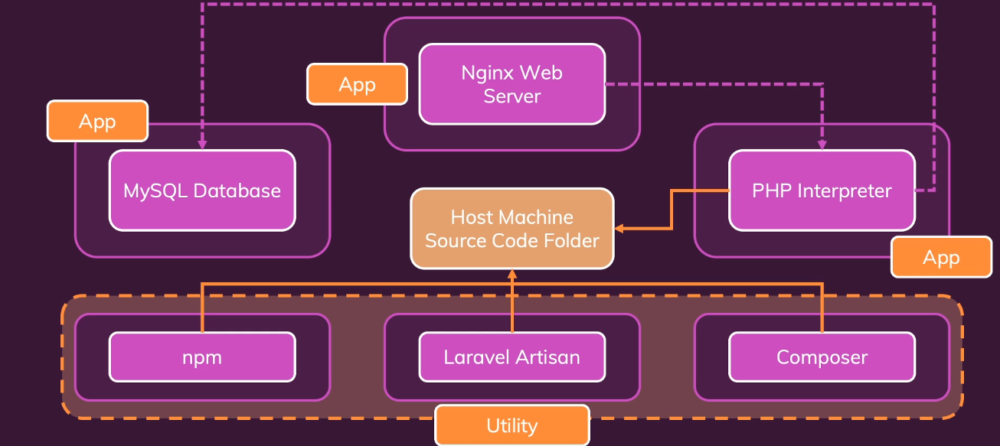

This project is based on the course: Docker & Kubernetes: The Practical Guide on Udemy. The goal is use the Docker engine as an alternative to install locally programs or applications. The Docker will be used instead, creating multiple containers for applications or programs that are not installed on local host.

For this task, will be 3 distincts Containers. First one is a PHP interpreter, called Laravel. All the dependencies for this application will be on this container. An application Nginx Web Server is dockerized in another container. This app is responsible to get resquests to the PHP and get responses from the same. The third Container is MySQL Database. All three apps in distinct containers will interact with at least another container, so they should be in the same network. Along with these Container Structure, others tools and utilities will be used, like npm, Lavarel Artisan and Composer. The image below, gotten from the course, tries to show how the structure is set. 

The key for this task is work with docker-compose to set up the entire project